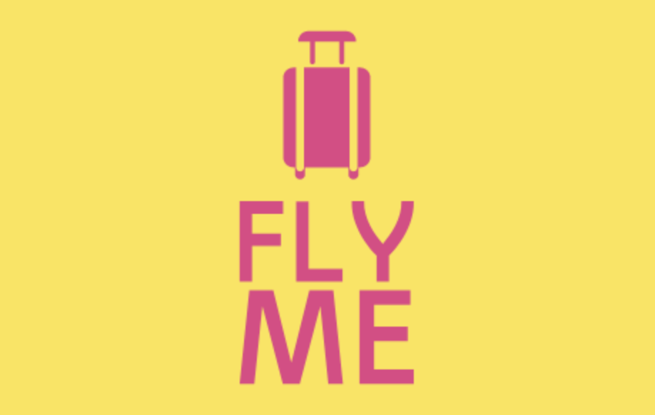

# Develop a Chatbot to Help Customers Make Holiday Reservation

> This project is the 10th project of the [AI Engineer](https://openclassrooms.com/fr/paths/188-ingenieur-ia) training path at [Openclassrooms](https://openclassrooms.com/fr/)

Fly Me is a turnkey travel provider for individuals and professionals.
Fly Me has launched an ambitious project to develop a chatbot to help users choose a travel offer.
The first phase of this project is to develop an MVP that will help Fly Me employees to easily book airline tickets for their holidays.

- **tools/train_test_split.py** to transform JSON data from the Microsoft dataset into LUIS compatible JSON data.
- **tools/authoring_and_predicting.py** train model on LUIS and test a prediction
- **tools/do_prediction.py** do prediction with tets data set
