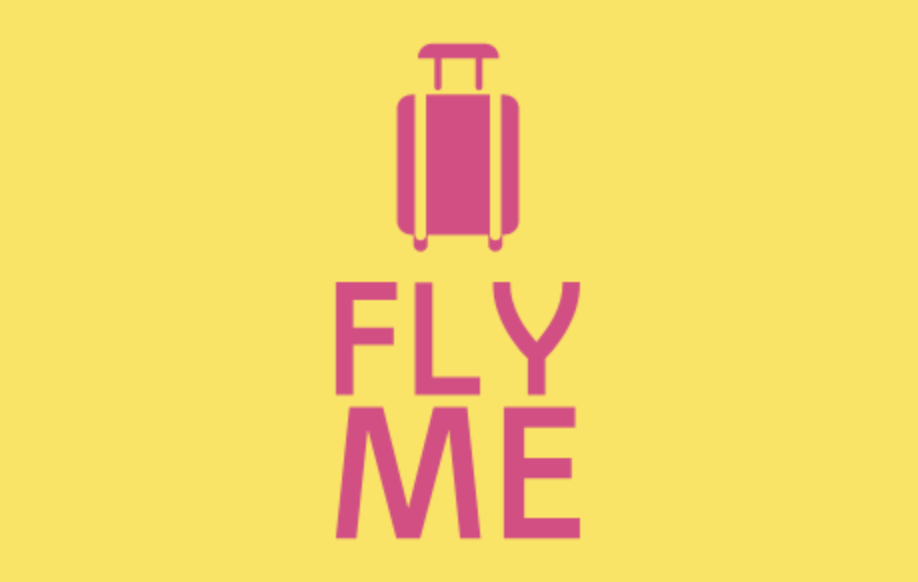

# Améliorez le produit IA de votre start-up

**Projet n° 10** du parcours [Ingénieur IA](https://openclassrooms.com/fr/paths/188-ingenieur-ia) chez [Openclassrooms](https://openclassrooms.com/fr/)

## Description
Fly Me est une agence qui propose des voyages clé en main pour les particuliers ou les professionnels. 

Fly Me a lancé un projet ambitieux de développement d’un chatbot pour aider les utilisateurs à choisir une offre de voyage.

La première étape de ce projet est de construire un MVP qui aidera les employés de Fly Me à réserver facilement un billet d’avion pour leurs vacances.

## Compétences
 - Intégrer la sortie du modèle dans un produit informatique fini
 - Intégrer une chaîne de traitement IA dans un outil informatique via Git
 - Piloter la performance du modèle en production
